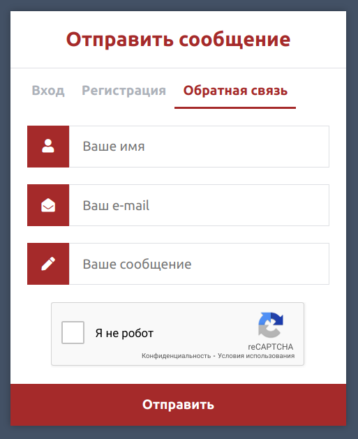

# FLaskMySQL_App


Репозиторий содержит проект с мини-сайтом, написанным на Python с помощью фреймворка Flask.
Содержит форму регистрации пользователей, форму входа на сайт (для зарегистрированных пользователей), а также форму обратной связи.

***Главная страница:***


***Страница регистрации:***


Регистрирует новых пользователей, записывает их в базу MySQL. 
К паролю требования такие:
- минимум 8 символов (буквы, цифры, спецсимволы);
- минимум одна буква в верхнем регистре;
- хотя бы один спецсимвол.

Все пароли хэшируются с добавлением соли.
При входе на сайт считается хэш введенного пароля, сранивается с хэшированным паролем, хранящимся в базе, при совпадении пускает на сайт. Также есть кнопка logout для выхода с сайта.

***Страница обратной связи:***



Позволяет отправить сообщение мне на электронную почту, предварительно отсеивая ботов с помощью Google ReCAPTCHA.

## Начало работы

```console
git clone https://github.com/an4ouce/FlaskMySQL_App
```

### Необходимое для запуска

- Убедитесь, что у вас установлен Docker и Docker Compose
  - Windows или macOS:
    [Установить Docker Desktop](https://www.docker.com/get-started)
  - Linux: [Установить Docker](https://www.docker.com/get-started) и затем
    [Docker Compose](https://github.com/docker/compose)

### Запуск

Корневая директория содержит файл `docker-compose.yml`, в котором описана конфигурация компонентов приложения (Flask и MySQL). Приложение может быть запущено на локальном компьютере с помощью команды:

```console
docker-compose up -d
```

Чтобы остановить и удалить все контейнеры этого приложения:

```console
docker-compose down
```

## Enjoy! 

